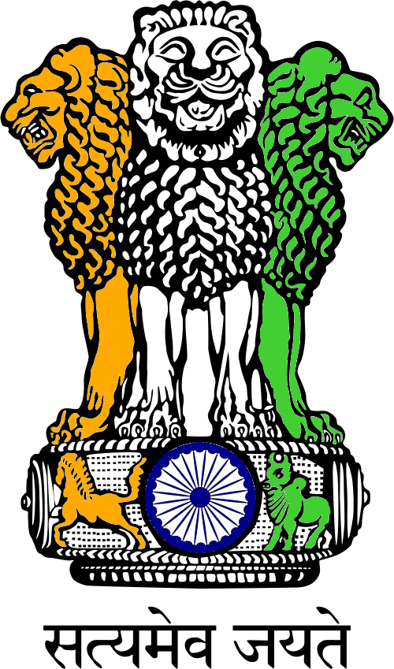

<!-- PROJECT LOGO -->
<br />
<p align="center">
  
  
  <h3 align="center">Ration-PDS</h3>

  <p align="center">
    Ration-PDS(Public Distribution System) for Government , FPS(Fair Price Shops) and Customer. 
    <br />
    <a href="https://github.com/rohan-mistry/Ration-PDS"><strong>Explore the docs »</strong></a>
    <br />
    <br />
    ·
    <a href="https://github.com/rohan-mistry/Ration-PDS/issues">Report Bug</a>
    ·
    <a href="https://github.com/rohan-mistry/Ration-PDS/issues">Request Feature</a>
	.
	<a href="https://github.com/rohan-mistry/Ration-PDS/doc/img/">View Screenshots</a>
  </p>
</p>


<!-- ABOUT THE PROJECT -->
## About The Project

<!--[![Product Name Screen Shot][product-screenshot]](https://example.com)  -->

The Indian food security system was established by the Government Of India under the Ministry of Consumer Affairs, Food and Public Distribution to distribute food and non-food items to India's poor at subsidised rates.
But the FPS have been misusing the grains recieved by the government for their own profits.To reduce such conspiracy ,was the main motive behind this project.

To handle the control of entire flow of the PDS system ,this application will be useful.

### Built With

* [Django 3.0.3](https://docs.djangoproject.com/en/3.0/)
* [Python 3.6](https://www.python.org/doc/)
* [ReportLab](https://www.reportlab.com/opensource/)


## Installation

Clone the repo
```sh
git clone https://github.com/rohan-mistry/Ration-PDS.git
```

Go Inside the app to create and activate virtual env
```sh
python -m venv venv
cd venv\Scripts\acivate
```

Install required packages
```sh
pip install -r requirements.txt
```

Setup application 
```sh
python manage.py migrate
python manage.py runserver
```


<!-- Features EXAMPLES -->
## Features

- Government
```sh
➼ Govermnent login will be made by the admin of this application.
➼ Govt can add the respective FPS and Customer with a unique OTP given to them for registering into this app.
➼ Send Stocks to FPS and see the delivery status.
➼ Stock Requests made by FPS.
➼ Get the information of a particular customer and see their ration data.
➼ Monthly Reports sent by FPS in pdf format.
 
```
- FPS
```sh
➼ Current stock availability. 
➼ Incoming stocks from the Government.
➼ Sell Monthly ration to only registered customers under their shop.
➼ Send monthly stock requests and reports. 
➼ See registered customers under their shop. 
```
- Customer
```sh
➼ See their info and current month ration status. 
➼ Previous records of their ration.
```


<!-- LICENSE -->
## License

Copyright © 2020 Rohan Mistry


<!-- CONTACT -->
## Contact

[Rohan Mistry](https://www.linkedin.com/in/rohan-mistry-826714180/) - mistryrohan13@gmail.com

Project Link: [https://github.com/rohan-mistry/Ration-PDS](https://github.com/rohan-mistry/Ration-PDS)
